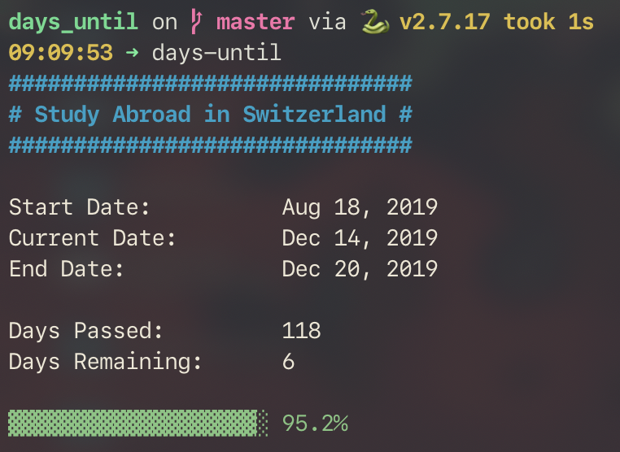

# days-until

This CLI helps you count down to upcoming events. Inspired by [`year-progress`](https://github.com/alichtman/scripts/blob/master/year-progress.sh).

<h1 align="center">
  
  <br />
</h1>

## Installation and Usage

```bash
$ pip3 install days-until
$ days-until --add  # The config file will be created the first time you run the program
$ days-until
```

### Options

```bash
$ days-until [OPTIONS]

  Count down days until events.
  Written by Aaron Lichtman. https://github.com/alichtman/days_until

Options:
  --add              Prompt to add events.
  --clean            Remove events with end dates that have passed.
  --compress         Compress output when printing.
  --config           Print path to config file.
  --remove           Interactively remove events.
  -v, --version      Print version and author info.
  -h, -help, --help  Show this message and exit.
```

## Configuration and Events

`days-until` reads its configuration from `$XDG_CONFIG_HOME/.config/days-until.yaml` or `~/.config/days_until.yaml`.

The easiest way to add events is with the `--add` option. If you'd like to add the events manually, they should be in the following format:

```yaml
event1:
  event: "Final Day in Switzerland"
  dates:
    start: "2019-12-7"
    end: "2019-12-20"
```

The top level keys (`event1` in this example) don't matter as long as they're unique. I tend to use `event{N}`, but anything will work.

- `event` is a string name for the event.
- `start` is the date on from which you'd like progress to be tracked.
- `end` is the date of the event.

All dates should be in `YYYY-MM-DD` format.

To remove entries interactively, use the `--remove` option.
